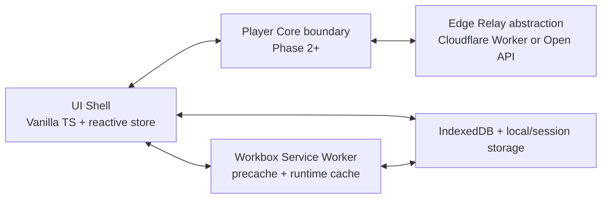

# Phase 1 Kickoff — PWA Foundation & Architecture (Personal/Educational Use)

## Compliance and platform reality (must-read)

- This project should remain **personal/educational** and not be distributed publicly.
- YouTube delivery internals (manifest shapes, signature/cipher logic, anti-bot controls, CORS, quotas) can change at any time.
- iOS Safari/PWA background media capabilities are limited by OS policy and are not fully controllable from web code.

## Phase 1 architecture (high-level)



## Proposed Phase 1 stack

- Vite + TypeScript (`strict: true`, ESM-only)
- Vanilla TypeScript UI + tiny store abstraction
- Workbox-generated service worker
- IndexedDB wrapper (typed)
- CSP + input sanitization baseline

## Proposed dependencies

### Runtime
- `idb`
- `dompurify`

### Build/dev
- `typescript`
- `vite`
- `workbox-build`
- `workbox-window`
- `@types/dom-purify`
- `eslint`
- `@typescript-eslint/parser`
- `@typescript-eslint/eslint-plugin`

## Base project structure (Phase 1 target)

```text
.
├─ public/
│  ├─ manifest.webmanifest
│  ├─ icons/
│  │  ├─ icon-192.png
│  │  └─ icon-512.png
│  └─ offline.html
├─ src/
│  ├─ app/
│  │  ├─ bootstrap.ts
│  │  ├─ router.ts
│  │  └─ state.ts
│  ├─ storage/
│  │  ├─ db.ts
│  │  └─ settings.ts
│  ├─ pwa/
│  │  ├─ register-sw.ts
│  │  └─ install-prompt.ts
│  ├─ security/
│  │  ├─ sanitize.ts
│  │  └─ csp.ts
│  ├─ styles/
│  │  └─ app.css
│  ├─ main.ts
│  └─ vite-env.d.ts
├─ service-worker/
│  └─ sw.ts
├─ package.json
├─ tsconfig.json
├─ vite.config.ts
└─ workbox-config.cjs
```

## Information required before code generation (as requested)

Please confirm these 4 inputs so the next Phase 1 response can include exact copy/paste files:

1. **Web dev experience**: beginner / intermediate / advanced
2. **Primary target browser/device**: e.g. Android Chrome 124+, Desktop Chrome, iOS Safari 17+
3. **Hosting preference**: GitHub Pages / Netlify / Vercel / self-hosted static + Cloudflare Worker
4. **UI preference**: Vanilla TypeScript (recommended) / React / Preact

Once confirmed, Phase 1 will include:
- exact `package.json`, `vite.config.ts`, `workbox-config.cjs`
- strict-mode TS source files with explicit paths
- debugging + validation checklist
- fallback strategy for manifest/cipher/CORS drift
